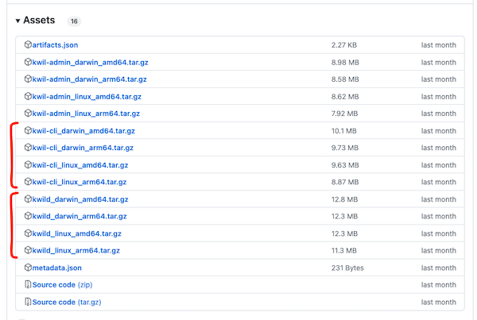

# Kwil <> Subsquid MVP


## Intro

This repository contains a basic implementation for how the Subsquid SDK can index and store data to a Kwil Database.

This repo is broken into two main parts:

- `kwil-subquid-adapater` - This is a simple package that contains a custom implementation of the Subsquid [`Database`](https://docs.subsquid.io/store/custom-database/) interface. This package follows the implementation of the [Subsquid File Store Repository](https://github.com/subsquid/squid-file-store/tree/master/file-store).

- `kwil-squid-demo` - A sample squid that uses the `kwil-subsquid-adapter` to index BAYC transfers and store them in a Kwil Database.

## Pre-requisites

1. Download the following from the [Kwil Release Repo](https://github.com/kwilteam/binary-releases/releases).

- Kwil CLI (`kwil-cli_...`)
- Kwil Daemon (`kwild_...`)



Extract the binaries and add them to your $PATH. For more on this, refer to this Stack Overflow [post](https://stackoverflow.com/questions/26021116/installing-a-program-through-mac-command-line-by-putting-binary-in-my-path).

2. Download the [Squid CLI](https://docs.subsquid.io/squid-cli/installation/).

3. Obtain an Ethereum Private Key to sign transactions on Kwil. If you have `openssl` installed, you can generate a key with the following command:

```bash
make generate-private-key
```

## Quick Start

Install all repository dependencies and compile typescript files:

```bash
make install
```

### 1. Start Kwil Daemon

To start the Kwil Daemon, run the following command:

```bash
make kwild-start
```

This will start a local Kwil node on your machine (available over http at `http://localhost:8080`), and will automatically generate the required configs for a node.

If you stop or close the terminal, the node will stop running.

### 2. Retrieve Chain ID

Retrieve the chain ID of the local Kwil node by running the following command:

```bash
make chain-id
```

### 3. Configure Kwil CLI

In a new terminal window, run the following command to configure the Kwil CLI:

```bash
make kwil-cli-configure
```

This will prompt you to enter the following. Make sure to use the Chain ID from the previous step:

```bash
Kwil RPC URL: http://localhost:8080
Kwil Chain ID: kwil-chain-...
Private Key: <YOUR_PRIVATE_KEY>
```

### 3. Deploy Kuneiform Schema

In [`kwil_schema.kf`](./kwil_schema.kf), there is a simple [Kuneiform](https://docs.kwil.com/docs/kuneiform/introduction) schema that defines the schema structure. The schema defines a single table called `transfers`, with two actions: `add_records` to insert data into transfers, and `count_records` to count the number of records in the table.

To deploy the schema, run the following command:

```bash
make deploy-schema
```

This will return a transaction hash. To check that the schema has been sucessfully mined on your local Kwil chain, run the following command:

```bash
hash=<TRANSACTION_HASH> make check-tx
```

### 4. Start Kwil Subsquid Demo

In the [`kwil-squid-demo`](./kwil-squid-demo/) directory, create a `.env` file with the following contents:

```bash
DB_NAME=squid
DB_PORT=23798
GQL_PORT=4350
PRIVATE_KEY=<YOUR_PRIVATE_KEY>
CHAIN_ID=<YOUR_CHAIN_ID>
```

Then, from the root directory, run the following command to start indexing data:

```bash
make start-squid
```

This will start indexing data all BAYC transfers and store them in a Kwil Database.

### 5. Query Kwil Database

As records are added to the database, you can check the amount of records in the `transfers` table by running the following command **in a new terminal**:

```bash
make count-records
```

You can also use the kwil-cli to query the database. For example, to get the first 10 records in the transfers table, run the following command:

```bash
kwil-cli database query "SELECT * FROM transfers LIMIT 10" -n=test_subsquid
```

## Caution

The `kwil-subsquid-adapter` library is not properly configured to pause and resume indexing.

If the indexer is paused, it will resume indexing from the beginning. If you start indexing on a schema that already has records, you may get an error because the record `id` (i.e. the table primary key) already exists.

If you want to pause and resume indexing, you will need to drop and re-deploy the schema. To drop the schema, run the following command:

```bash
make drop-schema
```

Then [re-deploy the schema](#3-deploy-kuneiform-schema).

## Next Steps

The `kwil-subsquid-adapter` is a simple implementation of the Subsquid [`Database`](https://docs.subsquid.io/store/custom-database/) interface. It should not be used in production.

The following steps can be taken to improve the adapter:

- Persisting index status to pause and resume indexing.
- Kwil error handling for rolling back transactions, when needed.
- Internally manage the action execution. Currently, the [processor](./kwil-squid-demo//src/main.ts) only sends data to Kwil for every 1000 records. This could be managed internally by the adapter, similar to how the [Subsquid File Store Repository](https://github.com/subsquid/squid-file-store) has a minimum bytes size before writing to file system.
- Add Subsquid logger to the adapter.

## Kwil Info

More information on Kwil can be found below:

- [Kwil Docs (Pre-release)](https://prerelease.kwil.com/)
- [Kwil Discord](https://discord.com/invite/HzRPZ59Kay/)
- [Kwil Github](https://github.com/kwilteam)
- [Kwil Twitter](https://twitter.com/kwilteam)
- [Kwil Website](https://kwil.com/)
